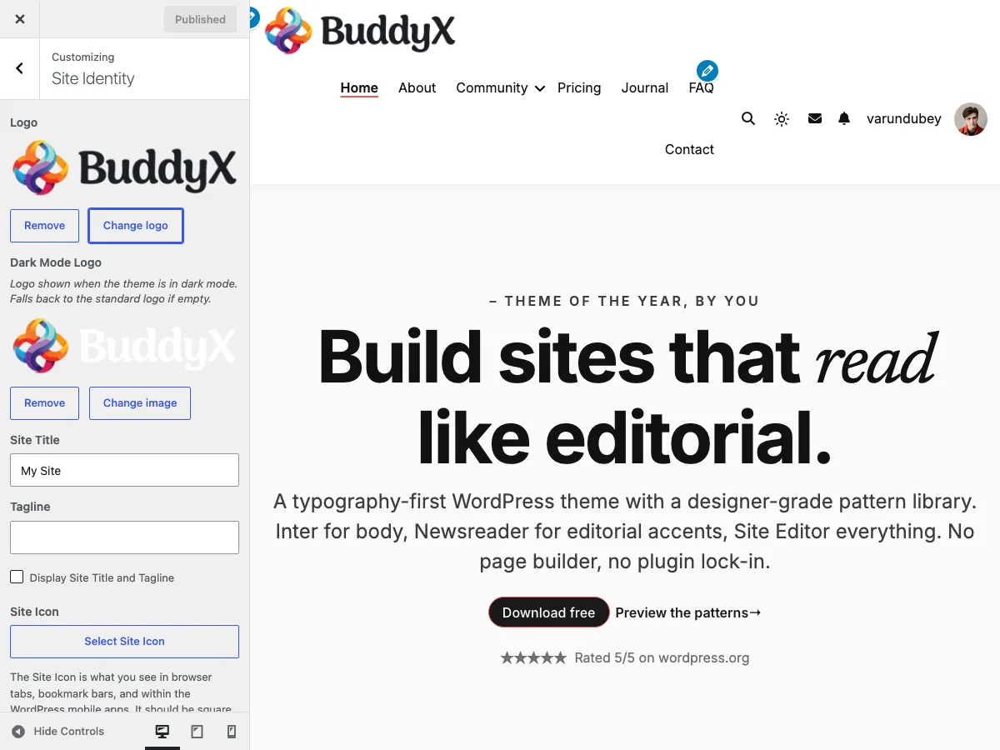
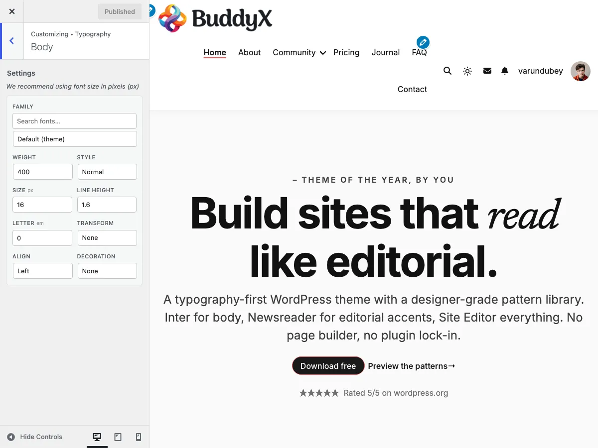
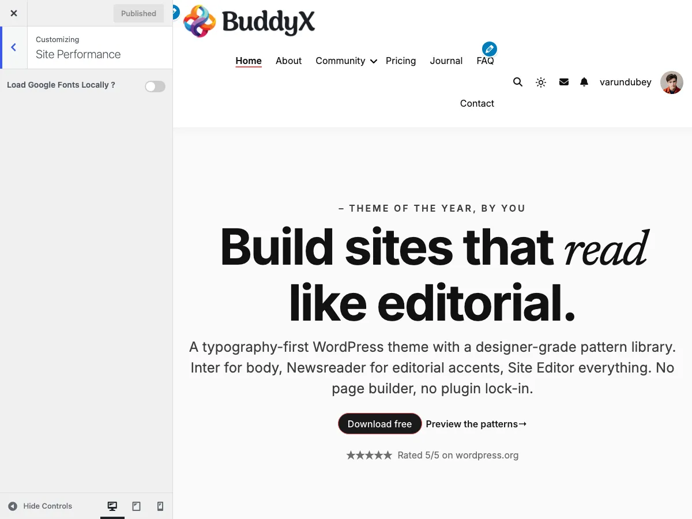

# Recipe: Customize your colors and fonts

**What you'll build**: A BuddyX site that reflects *your* brand — your color palette, your fonts, your visual identity. The site stops looking like "default BuddyX" and starts looking like your project.

**Time**: ~45 minutes (faster if you already have your brand decisions made)

**Prerequisites**:
- BuddyX activated, [Quick Start](../getting-started/quick-start.md) complete
- Your brand color(s) decided (the main one matters most)
- A logo file (PNG or SVG, transparent background)

---

## Before you start — three brand decisions

If you don't have these decided yet, decide now (it'll save you Customizer time):

1. **Your primary brand color** — one hex code (e.g., `#0066CC` for blue). This is the single most influential decision.
2. **Your heading font** — should it match the body font or be different? Sans-serif everything is safest; serif headings + sans body is classic.
3. **Your body font** — pick something legible. Inter, Open Sans, Source Sans, Lato, Roboto, IBM Plex are all safe sans-serif choices.

> **No designer / not sure?** A safe default: one sans-serif font for everything (e.g., Inter at 16px body, Inter Bold for headings) + your brand color as the only accent. Looks professional, never wrong.

---

## Step 1 — Site identity (5 minutes)

**Customize → Site Identity**:

1. **Logo** — upload your logo. Best as PNG (transparent background) or SVG, around 200×60 pixels for horizontal logos.
2. **Dark Mode Logo** *(optional)* — alternate logo for when the site is in dark mode. Only set this if your main logo doesn't read well on dark backgrounds.
3. **Site title** — your brand name (shows in browser tabs even when you have a logo).
4. **Tagline** — your one-liner (or leave blank).
5. **Site icon (favicon)** — upload a square 512×512 image.

Click **Publish**.

---

## Step 2 — Pick your primary color (3 minutes)

**Customize → Site Skin → Brand → Site Primary Color**:

1. Click the color swatch
2. Either:
   - Paste your brand color's hex code (e.g., `#0066CC`)
   - Use the color picker to pick visually
3. Watch the preview — buttons, menu hover, link hover all instantly take the new color

Click **Publish** to commit.

> **One color goes far**: BuddyX uses the primary color across buttons, menu hover, link hover, site title hover, footer link hover, copyright link hover, and the site loader. You usually don't need to set anything else color-wise.

---

## Step 3 — Pick (or pass on) a style preset (3 minutes)

**Customize → Site Skin → Style preset**:

The 8 presets are starting palettes. Each pairs accent colors, surface colors, and contrast levels.

| Preset | When to pick it |
|---|---|
| **Default** | You set your primary color and want everything else at BuddyX defaults |
| **Cool** | Tech / SaaS / professional services — cool-blue feel |
| **Dark** | Dark-first sites (designer portfolios, music, gaming) |
| **Editorial** | Magazines, content publishers, news — restrained palette |
| **Minimal** | Personal sites, portfolios — subtle and clean |
| **Monochrome** | Pure black-white-gray. Designer / agency portfolios |
| **Pastel** | Lifestyle, wellness, design — soft and approachable |
| **Vibrant** | Energetic brands — saturated accent colors |
| **Warm** | Hospitality, food, lifestyle — earthy palette |

**You don't have to pick one** — leaving Style preset on **Default** is perfectly fine. Pick a preset if it's closer to your visual brand than the default palette.

Remember: **your Site Primary Color from Step 2 stays the primary even if you pick a preset**. The preset only fills in elements you haven't customized yet.

Click **Publish**.

---

## Step 4 — Adjust button colors (3 minutes, optional)

By default, buttons use your Site Primary Color for background + border, white text. That's usually right.

But if your primary color is **light** (e.g., a pastel yellow), white button text on a light button is unreadable. Fix:

**Customize → Site Skin → Buttons**:

| Setting | Suggested |
|---|---|
| Button text | A dark color (e.g., `#111111`) if your button background is light |
| Button text hover | Same as above |

For most brand colors (medium-to-dark), the defaults work. Only adjust if the contrast looks wrong.

> **Quick test**: visit a page with a button. Can you read the button text clearly without squinting? If yes, you're good. If no, change button text color or background.

---

## Step 5 — Pick your body font (5 minutes)

**Customize → Typography → Body Typography**:

1. **Font Family** — pick from the Google Fonts dropdown (1000+ options)
   - **Safe bets**: Inter, Open Sans, Source Sans Pro, Lato, Roboto, IBM Plex Sans, DM Sans
   - **Variable / personality**: Outfit, Plus Jakarta Sans, Manrope
2. **Font Size** — `16px` is the standard body size. Don't go smaller; readability suffers.
3. **Line Height** — `1.6` to `1.8` for prose; `1.4` is tight (good for UI text but not for reading).

Click **Publish**.

> **Don't see Google Fonts loading?** See [Troubleshooting → Fonts aren't loading](../faq-support/troubleshooting.md#fonts-arent-loading).

---

## Step 6 — Pick your heading font (5 minutes)

**Customize → Typography → Headings Typography**:

You can set H1–H6 individually. Most sites set them all to the same family + size scale.

| Strategy | What to do |
|---|---|
| **One font everywhere** | Pick the same family as your body for H1–H6. Adjust **font weight** (e.g., 700 Bold) and **font size** for hierarchy. |
| **Serif headings + sans body** | Pick a serif (e.g., Playfair Display, Lora, Cormorant) for H1–H3. Leave H4–H6 at body family or default. |
| **Display font for hero, body for everything else** | Pick a display font (e.g., Bebas Neue, Anton, Oswald) only for H1. H2–H6 stay at body family. |

For each H1–H6:

- **Font Family** — your heading font
- **Font Size** — H1 around 40-48px, H2 around 32-36px, H3 around 24-28px, H4-H6 progressively smaller
- **Font Weight** — usually 600 or 700 for headings; some display fonts only come in 400

Click **Publish**.

> **Heading colors are in Site Skin, not Typography** — H1–H6 colors live at **Customize → Site Skin → Headings** (default `#111111` for all). Change there if you want headings in your brand color (though most sites keep them dark for readability).

---

## Step 7 — Menu typography (3 minutes)

**Customize → Typography → Menu Typography**:

- **Font Family** — usually the same as your body font (consistency reads professional)
- **Font Size** — 14-16px works for desktop menus
- **Font Weight** — 500 or 600 (slightly bolder than body for clarity)
- **Text transform** — UPPERCASE feels assertive; standard case feels friendly

For sub-menu items, **Sub Menu Typography** has the same fields.

Click **Publish**.

---

## Step 8 — Localize fonts for speed + privacy (2 minutes)

By default, BuddyX loads Google Fonts from Google's CDN. You can host them on your own server instead:

**Customize → Site Performance**:

1. **Load Google Fonts Locally** → **On** (the master toggle — off by default)
2. After step 1, two additional controls appear:
   - **Preload Local Fonts** → **On** (tells the browser to start downloading fonts in parallel with HTML)
   - **Flush Local Fonts Cache** button — click after changing fonts so the cached files refresh

Click **Publish**.

This:
- **Faster page loads** — no DNS lookup to Google
- **Better privacy** — Google doesn't see your visitors loading fonts
- **Better GDPR compliance** — no third-party request to a US-based CDN

> **Note**: if you change fonts after enabling local hosting, BuddyX caches the new font files automatically. If you ever need to clear the cache, there's a **Flush local font cache** button on the same Customize → Site Performance panel.

---

## Step 9 — Visual check (5 minutes)

Visit your site in an incognito window (so the admin bar doesn't distort the layout):

1. **Home page** — does the hero feel like your brand?
2. **A blog post** — is body text readable? Do headings stand out enough?
3. **A button** — is the button text readable on the button background?
4. **The header menu** — does the menu font look right with the logo?
5. **Footer** — does the footer color scheme balance the header?
6. **Toggle dark mode** — click the sun/moon icon. Does the dark version look ok? (If you customized button text to dark, it might disappear on a dark-mode button — adjust if needed.)
7. **Mobile** — resize the browser narrow, or check on your phone. Anything broken?

---

## Step 10 — Iterate

Brand customization is rarely one-shot. After living with your site for a few days:

- A color might look "off" once it's on every button — adjust the primary
- A font you loved in isolation might feel wrong for body — try a different one
- The H1 size might be too big or small — adjust

Every Customizer setting is editable forever. Come back when you have feedback.

---

## Common questions

**Where's the "color preset" feature with 14 options?**
That's a BuddyX Pro feature (14 color presets + 7 typography presets). BuddyX free has **8 style presets** which combine palette ideas — see Step 3. If you need fine-grained preset control, [BuddyX Pro](https://wbcomdesigns.com/downloads/buddyx-theme/) is the upgrade path.

**Can I use my own font (not a Google font)?**
Not directly in the Customizer. To use a custom font (Adobe Fonts, self-hosted), you'll need a small CSS snippet in a child theme or via the "Additional CSS" panel (**Customize → Additional CSS**) — declare the `@font-face` and override `--bx-color-*` token... wait, that's a font, not a color. Set `font-family` on `body` / `h1-h6` in Additional CSS.

**My brand color is light-on-light or hard to read.**
You can't override physics. If your brand color is, say, light yellow, you'll need:
- Dark button text (Step 4)
- Darker hover states than your primary
- Maybe don't use the brand color for body links — use a higher-contrast color and reserve brand color for buttons + accents only

Consider using a darker shade of your brand color for the Customizer (and the lighter version in your logo).

**How do I save my brand setup to reuse on another site?**
WordPress has a built-in **Tools → Export** which includes Customizer settings. On the new site, **Tools → Import**. Or copy specific theme_mods via WP-CLI: `wp option get theme_mods_buddyx > brand.txt` on the source, `wp option update theme_mods_buddyx "$(cat brand.txt)"` on the destination.

---

## Related

- [Color Scheme](../skin-colors/color-scheme.md) — every color setting explained in detail
- [Dark Mode](../skin-colors/dark-mode.md) — color mode + visitor toggle
- [Match the demo design](./match-the-demo.md) — the reverse recipe: how to look exactly like the BuddyX demo
- [Quick Start](../getting-started/quick-start.md) — first-time setup walkthrough
